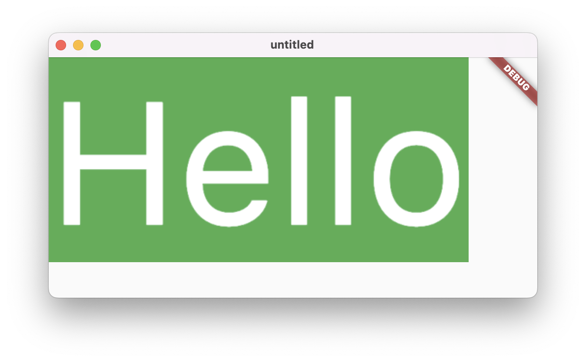

# flutter-memos
Just for me

[Wiki](../../wiki)

# Snippets

[Draw text on image canvas:](draw_text_on_image_canvas.dart)

<a>

* * *

[Get text bounds:](get_text_bounds.dart)

To determine the smallest rectangle that completely encloses a single-line text:

* I use `TextPainter` to draw the text into a `ui.Image`. Then I search for the transparent pixels to calculate the bounds.
* (Caution) The bounding rectangle can also have negative values.
* (Caution) Documentation on `TextPainter.width`: *The horizontal space required to paint this text.* Not quite right: With many fonts and italics, the space is exceeded both to the left and to the right. Therefore, to be on the safe side, I initially widen the image by 20 percent.
* (Caution) The rectangle is only correct if the text itself can determine how much space it takes up. But if there is too little space, the text may be scaled down or wrapped into multiple lines.

* * *
