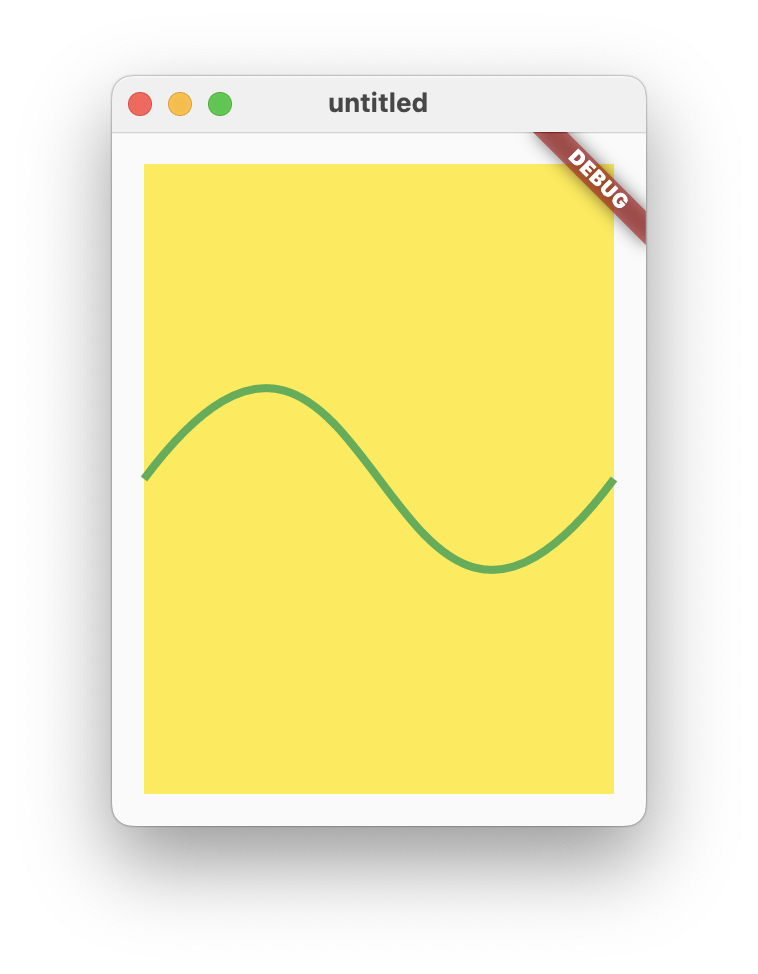

# flutter-memos
Just for me

## [Wiki](../../wiki)

# Snippets

## [Animation with cubits](owl_animation.dart)

<a></a>

***

## [AnimationBuilder with ValueNotifier:](animation_builder_with_value_notifier.dart)

<a></a>

* I converted the Flutter starter app so that an AnimationBuilder listens to a ValueNotifier and therefore the State object can be omitted.
* [Same with Provider and ChangeNotifier](flutter_demo_home_page_provider.dart)

* * *

## [Custom Painter](custom_painter.dart)

<a></a>

* * *

## [Draw text on image canvas:](draw_text_on_image_canvas.dart)

no scale:
<a></a>

upscaled:
<a></a>

* To display a `ui.Image` directly as a widget without having converted it to an `Image` first (you need to calculate the `width` and `height` before):

    ```dart
    return Stack(
    children: [
        Container(
        width: width,
        height: height,
        color: Colors.green,
        ),
        SizedBox(
        width: width,
        height: height,
        child: RawImage(
            image: image,
        ),
        ),
    ],
    );
    ```

* * *

## [Get text bounds:](get_text_bounds.dart)

To determine the smallest rectangle that completely encloses a single-line text:

<a></a>

* I use `TextPainter` to draw the text into a `ui.Image`. Then I search for the transparent pixels to calculate the bounds.
* The bounding rectangle can also have negative values.
* (Caution) Documentation on `TextPainter.width`: *The horizontal space required to paint this text.* Not quite right: With many fonts and italics, the space is exceeded both to the left and to the right. Therefore, I reserve some extra space for the width of the temporary image.
* (Caution) The rectangle is only correct if the text itself can determine how much space it takes up. But if there is too little space, the text may be scaled down or wrapped into multiple lines.

* * *

## [Shortcuts Intents Actions:](shortcuts_intents_actions.dart)

<a></a>

We define a `Shortcut` (cmd+T) that applies globally to all widget trees. The `Shortcut` is associated with an `Intent`. The `Intent` in turn is connected to `Actions` in different widgets and these `Actions` are implemented differently each time: The `ColorToggler` changes the color of its button label while the `WeightToggler` changes the font of its button between normal and bold. Alternatively, the `Actions` can be called directly by pressing the button itself.

* In the `ColorToggler` and in the `WeightToggler` we cannot return `ElevatedButton` directly because we need the `BuildContext` of the `Action` widget and not that of the `ColorToggler` and `WeightToggler` respectively. Therefore we need `Builder`.

* * *
## [FocusableActionDetector Example from Flutter documention](focusable_action_detector_example.dart)

<a></a>

I changed the Example:

* Swapped `FocusableActionDetector` and `GestureDetector` to make `onTap: Actions.handler(...)` possible (removes code duplication with `_toggleState`).
  
* Added `widget.onPressed()` to `_toggleState` to invoke callback.
  
* Added type information to `_actionMap` to prevent crash.

# [Login with BloC and `go_router`](go_router_with_bloc.dart)

<a></a>

* Unfortunately, the path is not displayed in the address bar directly after logging out and logging back in.
  
    * Solution:

        Instead of a static object:

        ```dart
        final _routes = GoRouter(...);
        ```

        we should create a new object each time:

        ```dart
        GoRouter get _routes => GoRouter(...);
        ```

# [Firebase, BloC and `go_router` login](firebase_bloc_login.dart)

<a></a>

## Write and read Firebase Storage

[firestore_messages_cubit.dart](firestore_messages_cubit.dart)

Synchronize messages:

```dart
BlocBuilder<MessagesCubit, List<Message>>(
  builder: (context, state) {
    final messages = state.map((message) =>
        Text('${message.simpleUser.email}: ${message.content}'));
    return ConstrainedBox(
      constraints: const BoxConstraints(maxHeight: 400),
      child: SingleChildScrollView(
        child: Column(children: [...messages]),
      ),
    );
  },
),
```

Send messages:

```dart
context
  .read<MessagesCubit>()
  .sendMessage(Message(
    content: _messageController.text,
    simpleUser: (state as Authenticated).user.toSimpleUser));
```

## Firebase only

[firestore_only.dart](firestore_only.dart)

<a></a>

## Transition animation with fixed and moving widgets

When we navigate between different pages with a 'Router', the entire screen is animated during the transition. However, if parts of the screen are to be static, the [Animations package](https://pub.dev/packages/animations) will help us. Here, the drawer and the top line of text should be static. The long text below should slide during the transition.

[transition_animation_with_fixed_parts.dart](transition_animation_with_fixed_parts.dart)

<a></a>

To slow down transition animation:

```dart
import 'package:flutter/scheduler.dart' show timeDilation;

void main() {
  timeDilation = 4;
  runApp(const MainApp());
}
```

The key is `PageTransitionSwitcher`:

```dart
PageTransitionSwitcher(
  reverse: _reverse,
  transitionBuilder: (child, animation, secondaryAnimation) {
    return SharedAxisTransition(
      animation: animation,
      secondaryAnimation: secondaryAnimation,
      transitionType: SharedAxisTransitionType.horizontal,
      child: child,
    );
  },
  child: PageWithButton(key: ValueKey(page), page: page),
),
```